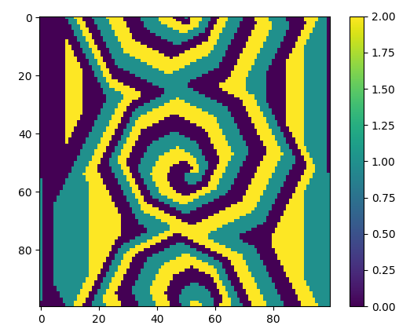

# Modelling "Rock, Paper, Scissors" on a grid of cells.

### A simulation of cells using update rules similar to those used in the game "rock, paper, scissors". Both deterministic and stochastic algorithms are used and the dynamics were studied as well as different initial conditions.

* `rps.py` contains the deterministic algorithm where cells are updated based on those around them with no uncertainty. A visualisation can be shown with `python rps.py vis <grid size~100>`. The initial conditions are the same each time and look like a square pie chart. A steady state is always reached which looks like this:

* `randomseq.py` contains the stochastic algorithm where cell types are changed with variable probabilities based on the types of neighbours they have. A visualisation can be shown with `python randomseq.py vis <grid size~50>`, and probabilities can be adjusted in `randomseq.main`. Simulations reach different states depending on these values.

A colour plot showing how the average minority fraction (proportion of cells with the least common type) varies with the probabilities of paper -> scissors and scissors -> rock. Other system dynamics were studied such as the variance of the minority fraction and oscillations in states over time.